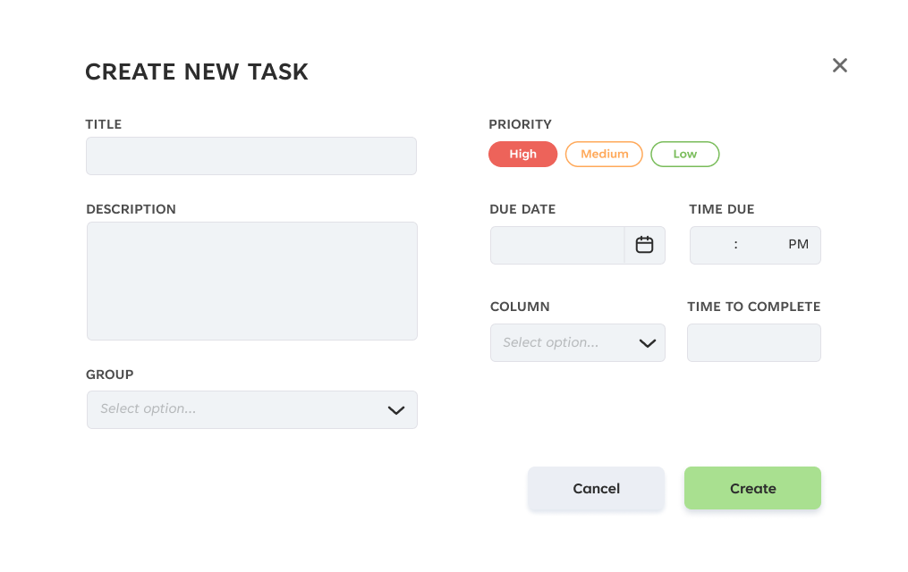
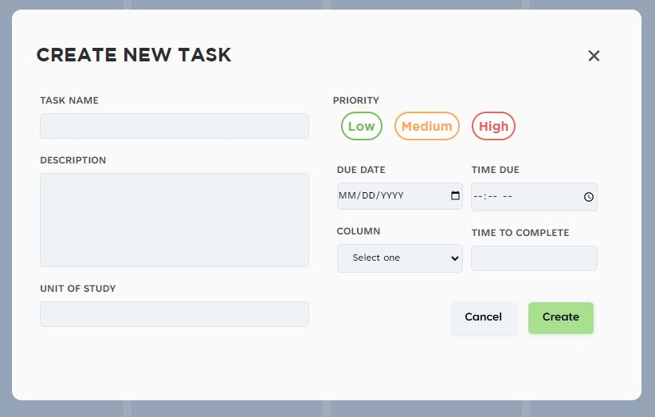
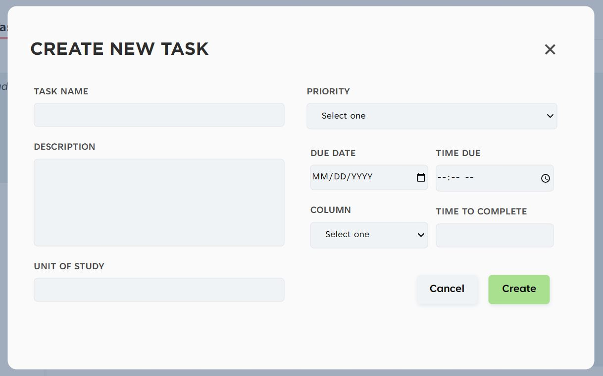
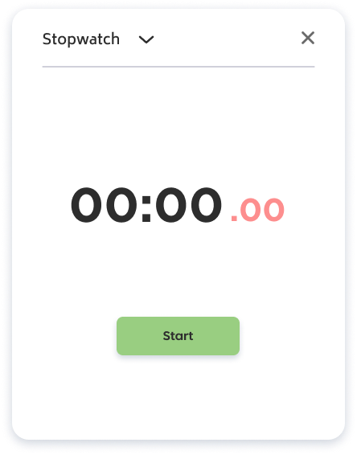
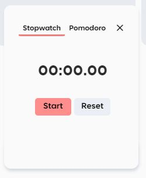
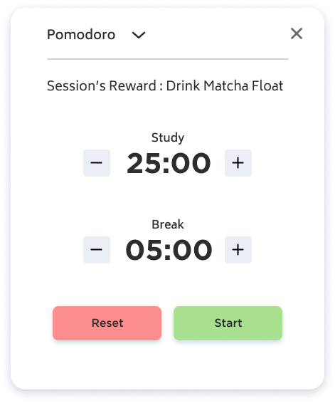
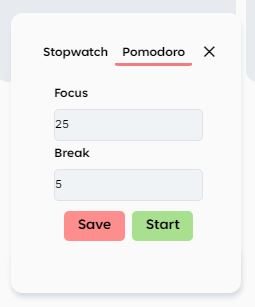
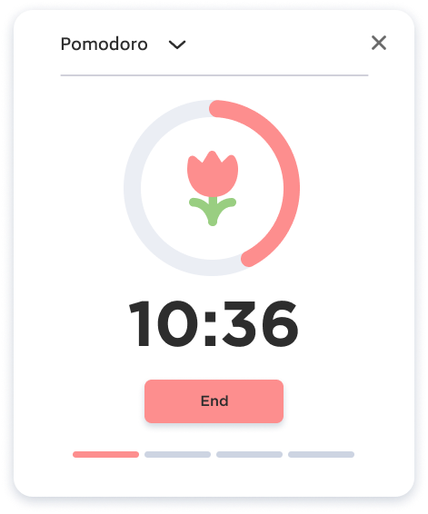
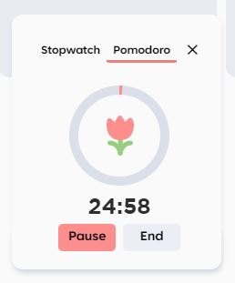
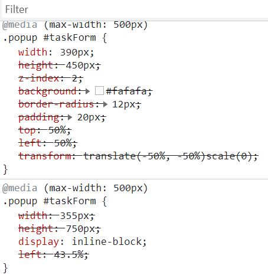

# stud-bud
# **STUDBUD**
## **A2 FEEDBACK**

Regarding the previous assessment, I received feedback from my tutor on my design to improve the user experience:
>_“Perhaps however the 'add task' button should be somewhere near the top? This could be easier to find, especially if the task lists are very long."_

Therefore, before implementing the high-fidelity mockup designs to the web app prototype, I decided to change these features in the mockup to see what it looks like and asked a user to test some of the interactions for further iteration if needed to ensure the navigation was seamless.

### BEFORE

>_Tasks to create were shown after the last task_

### AFTER

>_Added a task button at the bottom beside + add column_

## **REQUIREMENTS**
### 1. TASK LIST + KANBAN BOARD
I firstly created the functionalities for the kanban board where users could create and delete tasks. This was done through HTML and tasklist.js, through the help of week 5-9 tutorials.

Task list functionality was through storing the input of the user with an ID. After that I worked on the styling of the tasks and kanban board so I could have a better look of how it can be draggable across the columns. However, the design was not what I wanted due to some difficulties:

#### MOCK UP

>_This is how the create a new task popup looked like in the mockup_

#### CSS STYLING ITERATION

>_I managed to create a similar look to the mockup, however I had to change the priority buttons due to the functionality._

#### CSS STYLING ITERATION II

>_Whenever a task was created, the value was always undefined. Additionally, I changed from GROUP to UNIT OF STUDY so it is more specific towards university students and instead of a dropdown the input was just in text to allow them to write. One functionality that I did not manage to accomplish is to colour code the unit of study, which is something I would want to work on in the future._

_
### 2. POMODORO TIMER + STOPWATCH
I watched a few youtube tutorials on building pomodoro timers and stopwatch to have a better understanding of where to start, which was really helpful. I put the resources in my references.

Firstly, I started with creating the html elements including the time and the buttons and worked on the styling before adding the functionality so I could better look at the screen. I found it difficult to make the screen switch from pomodoro to stopwatch and vice-versa but managed to accomplish it at the end.

I could only do the localStorage for the pomodoro timer due to time constraints, however, something to improve would be _including the time when the overlay is closed instead of having the user click to check._

_

#### MOCK UP STOPWATCH

>_The stopwatch during mockup phase had a dropdown where users would select between Stopwatch and Pomodoro Timer_

#### CSS STYLING ITERATION

>_I changed from a dropdown to just having the two timers beside each other. This allows users to easily select what they need instead of having to go through a dropdown. I would still add the pink coloured seconds from the mockup, however I decided to leave it be for accessibility._

>_In terms of functionality, once the START button is clicked, it changes to STOP button, thus allowing users to pause the stopwatch whenever they feel like._

_

#### MOCK UP POMODORO

>_The buttons moved in increments of 5_

#### ITERATION

>_Due to time constraints I created a different way to input focus and break time. The default time is 25 minutes focus and 5 minutes break, however users an change to any value they would like and it would be stored for future use. One thing I would improve on is to consider how long the user would want to have a break after 4 sets._

_

#### MOCK UP POMODORO II

>_This mockup displays 4 progress bars below signalling how many sets they have done._

#### ITERATION

>_I managed to get something similar to my mockup, however without the progress bars at the bottom_

_
### 3. MUSIC PLAYER
I had an issue where the music player is not working; it states that there is an error when trying to get the audio and the images.

### 4. RESOURCES PAGE
The resources page has similar features to the task details, however it stated that the function I created was not defined although it was the same process as the kanban board/tasks page. I had trouble working on it because everytime I linked it in a href as another page, it would always display it as 404 error.

## **RESPONSIVE WEB APP**
The main issue I encountered was that the kanban columns were not scrollable although I added overflow-x: scroll; The scroll bar did appear below the columns but i could not use it.

Additionally, I changed some of the responsiveness for the mobile device, however nothing was happening on my end. I had to go to the inspect tool and untick the styling to see how it looked like, so I am not sure what the outcome is.

## **STYLING**
The original plan was to do the CSS styling at the end of the progress (after adding functionalites...). However, I found it easier to do it throughout the whole process so I could visualise what I was doing and not get lost. I added small features such as change of colour when hovering over buttons to suggest that it is clickable.

## **FURTHER IMPROVEMENTS**
There are some improvements of the web app that could be made:
#### STYLING
For the future, I would work more on the styling of my web app to look more similar to the mockups I created in the previous assignment.

#### HTML, CSS & JS
- I should refrain from using break tags in future projects
- The use of CSS grid for this assignment would have been very useful to improve the responsiveness of the web app and but I did not use it. The code could have been neater as well and have a clearer structure.
- As coding is not my strongest suit, I still have yet to learn a lot more about Javascript. Watching videos was helpful but I still found it hard to try to complete the functionalities on my own. To improve, I would have to practice further.
- There are some functionalities that I was not able to add. One of the main functions was adding the Column, however I did make the columns editable.
- I should consider localStorage in the beginning of the functionality process

#### FUNCTIONALITY
In terms of functionality, there are many more things to change and add. To improve even further with the overall user experience, I would add a popup asking if the user was sure they would want to cancel what they were creating (i.e. new task, material...). Secondly, although the column titles are editable, it does not suggest so to the user. It may come off as a surprise if they select by mistake. Therefore, I would add an edit button beside the title so the user could either select it or delete it. Thirdly, it would be great for the future if the stopwatch, pomodoro timer and music player doesn't stop from carrying the tasks while navigating across different pages. 

## **REFLECTION**
This assignment was really challenging but it was satisfying to see the end result.

### REFERENCES
abhik b (2021, January 5). Mini Javascript Project – Pomodoro Timer with Circular Progress Indicator (Vanilla JS, HTML ,CSS) [Video File]. Retrieved from https://www.youtube.com/watch?v=MtYR2vCs2R0&t=4s

Ant, A. (2020, October 9). Retrieved from Unsplash: https://unsplash.com/photos/VotSVvmJSic

CodeWithMe (2020, July 15). Stopwatch using javascript | stopwatch using html,css and javascript [Video File]. Retrieved from https://www.youtube.com/watch?v=TdJRtsYLuaU 

Codingflag ( 2020, February 18). How to Create Simple Popup Box / Modal using HTML CSS & JavaScript [ Video file]. Retrieved from https://www.youtube.com/watch?v=iE_6pQ3RlZU 

CSS overflow Property. (n.d.). Retrieved from W3schools: https://www.w3schools.com/cssref/pr_pos_overflow.asp

Dahms, K. (2019, September 12). Bubbly Bubbles 2. Retrieved from Unsplash: https://unsplash.com/photos/217U8oxGoQ4

dcode (2019, June 28). Make Other Elements Content Editable – HTML5 “contenteditable” attribute [Video File]. Retrieved from https://www.youtube.com/watch?v=Rm1mFbLnh88 

Dongas R. (2022). DECO2017 Advanced Web Design, tutorial 5, week 5: Code Walkthrough – Interactive Task List [Video File]. Retrieved from https://sydney.instructuremedia.com/lti-app/embed/perspective/6jZLUBigFRNkoH_BZUAR-Q 

Dongas R. (2022). DECO2017 Advanced Web Design, tutorial 9, week 9: Code Walkthrough – Task List Improvements [Video File]. Retrieved from https://sydney.instructuremedia.com/lti-app/embed/perspective/r-Q0ZpyggfbdqCN53ruvwg 

HTML: Forcing INPUT text to uppercase. (2019, January 13). Retrieved from THE ART OF WEB: https://www.the-art-of-web.com/html/input-field-uppercase/#:~:text=On%20every%20keystroke%20a%20JavaScript,convert%20the%20value%20to%20uppercase.&text=Aside%20from%20the%20distraction%20of,changing%20it%20to%20'ABBA'.

Marina, R. (2022, May). Retrieved from Unsplash: https://unsplash.com/photos/_kpDecnNmLw

olyasha. (2017, November 24). When you click on the button, display a message. Retrieved from stack overflow: https://stackoverflow.com/questions/47479365/when-you-click-on-the-button-display-a-message

Payenda B. (2020, December 22). To Do App Using HTML, CSS and Javascript (Drag & Drop)|Project #10/100 [Video File]. Retrieved from https://www.youtube.com/watch?v=m3StLl-H4CY&t=50s 

Style borderBottom Property. (n.d.). Retrieved from w3schools: https://www.w3schools.com/jsref/prop_style_borderbottom.asp

Tissot, B. (n.d.). E.R.F. Retrieved from bensound: https://www.bensound.com/royalty-free-music/track/erf

Tissot, B. (n.d.). Piano Moment. Retrieved from bensound: https://www.bensound.com/royalty-free-music/track/piano-moment

Tissot, B. (n.d.). Sci Fi. Retrieved from bensound: https://www.bensound.com/royalty-free-music/track/sci-fi

Traversy Media (2021, April 11). Build a Music Player | Vanilla Javascript [Video File]. Retrieved from https://www.youtube.com/watch?v=QTHRWGn_sJw 

Varun. (2018, May 16). Set the navigation bar to stay at the bottom of the web page with CSS. Retrieved from tutorialspoint: https://www.tutorialspoint.com/Set-the-navigation-bar-to-stay-at-the-bottom-of-the-web-pagewith-CSS#:~:text=Category-,Set%20the%20navigation%20bar%20to%20stay%20at%20the,the%20web%20page%20with%20CSS&text=To%20set%20the%20navigation%20bar,fixed%20property

WebKitCoding (2020, June 9). Switch b/w Login & Signup Form using HTML, CSS & Javascript | Toggle Switch Form [Video File]. Retrieved from https://www.youtube.com/watch?v=uQTpr23G5yY 